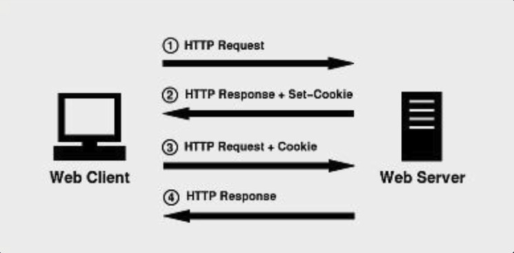
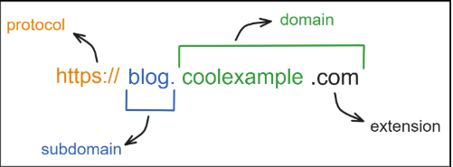

# 쿠키

서버가 사용자의 웹 브라우저에 전송하는 작은 데이터 조각이다. 브라우저는 그 데이터 조각들을 저장해 놓았다가, 동일한 서버에 재요청 시 저장된 데이터를 함께 전송한다.

쿠키는 두 요청이 동일한 브라우저에서 들어왔는지 아닌지를 판단할 때 주로 사용한다. 이를 이용하면 사용자의 로그인 상태를 유지할 수 있다. stateless한 HTTP 프로토콜에서 상태정보를 기억시켜주기 때문이다.

웹 브라우저를 껐다 키거나 컴퓨터를 껐다 키더라도 쿠키 값은 유지되기 때문에 평소에 우리가 사이트를 한 번 로그인하면, 일정기간 동안은 로그인하지 않아도 로그인이 유지된다.

## 특징

- 서버로부터 리스폰스로 쿠키를 받으면, 클라이언트에서는 별도로 작업을 해주지 않아도 웹 브라우저가 알아서 저장하고 리퀘스트를 보낼 때도 웹 브라우저가 알아서 보낸다.
- 자바스크립트를 통해서 쿠키 값을 추가,수정,참조할 수 있다.
- 수명을 지정할 수 있다. 수명이 다한 쿠키는 알아서 지워진다.

## 쿠키 사용법

### 서버에서 리스폰스할 때

서버에서 `set-cookie` 헤더를 리스폰스로 보내주면 웹 브라우저는 알아서 쿠키 값을 저장해 둔다.

    Set-Cookie: session-id=1234; Domain=codeit.kr; Path=/; HttpOnly; Secure; SameSite=Strict; Max-Age=2592000;

- `session-id` : 쿠키의 key
- `1234` : 쿠키의 value
- `domain`, `path`, `samesite` 등은 쿠키의 Attribute에 해당한다.

참고로 위에적혀있는 attribute나 헤더들은 대소문자를 구분하지않기에 `set-cookie`,`samesite` 이런 식으로 사용할 수도 있다.

### 클라이언트에서 보낼 때

리퀘스트를 보낼 때 주소에 해당하는 쿠키가 저장되어 있다면 웹 브라우저가 알아서 쿠키를 보내준다.

    Cookie: session-id=1234; Domain=codeit.kr; Path=/; HttpOnly; Secure; SameSite=Strict; Max-Age=2592000;

### 자바스크립트로 사용하기

보통은 서버가 쿠키 값을 만들고, 클라이언트에서는 웹 브라우저에 맡기고 건드리지 않는 것이 권장된다. 하지만 클라이언트에서 자바스크립트로 추가/수정/참조할 수도 있다.

#### 추가, 수정하기

변수 할당처럼 보이지만 이 코드는 새로운 쿠키를 추가하거나 수정하는(기존에 `session-id` 라는 쿠키가 있다면) 코드이다.

    document.cookie = "session-id=1234; Domain=codeit.kr; Path=/; HttpOnly; Secure; SameSite=Strict; Max-Age=2592000;";

#### 값 참조하기

- document.cookie 값을 참조하면 모든 쿠키의 키와 값이 ; 문자로 구분된 문자열이다.
- split() 함수를 사용해서 직접 분리해서 사용하는 등 다양한 방법들이 있다.
- [cookie](https://www.npmjs.com/package/cookie) 라는 NPM 패키지를 활용할 수도 있다.

#### 값 지우기

`Max-Age` 값을 0으로 업데이트하면 (수명 = 0) 지워진다.

    document.cookie = "session-id; Max-Age: 0;";

## 다양한 Attribute

### `Domain`

브라우저가 쿠키를 보낼 도메인을 지정한다. 예를들어, `Domain=example.com` 라고 하면 `https://home.example.com`, `https://post.example.com` 같은 서브 도메인에 리퀘스트를 할 때도 쿠키를 보낸다.

### `Path`

브라우저가 쿠키를 보낼 경로를 지정한다. 예를들어, `Path=/` 라고 하면 `/` 아래에 있는 경로들, `/abc`, `/abc/xyz` 같은 경로에 리퀘스트를 보낼 때에도 모두 쿠키를 보낸다.

### `HttpOnly`

`document.cookie` 값을 자바스크립트로 사용할 수 있으면, 해커들이 악성 코드를 사용자들에게 유포해 쿠키를 훔칠 수 있다.

로그인 정보 같은 민감함 정보는 되도록이면 자바스크립트로 조작하지 않는 게 좋다. `HttpOnly` 를 사용하면 쿠키를 자바스크립트로 사용하지 못하게 막을 수 있다.

### `Secure`

`Secure` 를 지정하면 HTTPS 리퀘스트를 보낼 때만 쿠키를 보낸다. 참고로 `samesite=None`을 지정하면 반드시 `Secure` 도 함께 지정해야한다.

### `SameSite`

자바스크립트를 사용하면 현재 사이트에서 다른 사이트로 리퀘스트를 보낼 수 있고, 사이트의 링크를 클릭하면 웹 브라우저는 다른 사이트로 GET 리퀘스트를 보내며 이동한다. 그리고 이미지 파일은 다운 받거나 할 때도 GET 리퀘스트를 보내서 받는다.

예를 들어, `example.com` 라는 사이트에서 쿠키를 발급해서 사용자가 저장하고 있는데, 사용자가 `hacker.com` 이라는 악성 사이트에 접속한다고 하자. 이 악성 사이트는 `example.com` 이라는 사이트로 리퀘스트를 보내서 개인정보를 탈취한다. 악성 사이트에서 예시사이트로 리퀘스트를 보낼 때 쿠키가 함께 간다면 당하는 것이다.

이러한 공격을 크로스 사이트 요청 위조 CSR(CSRF), XSR(XSRF) 라고 한다. 이를 방지하기 위해서 제 3자 사이트에서 쿠키를 보내지 못하게 `samesite`를 지정해야한다.

`SameSite` 속성의 값에는 `Strict`, `Lax` (아무것도 지정하지 않았을 때 기본값), `None`이 있다. 다음은 `SameSite` 값에 따른 쿠키 전송 유무를 정리한 표

|                                                                | SameSite=Strict | SameSite=Lax | SameSite=None |
| -------------------------------------------------------------- | --------------- | ------------ | ------------- |
| 다른 사이트에서 우리 사이트로 리퀘스트를 보낼 때               | X               | X            | O             |
| 다른 사이트에서 이미지 파일 등을 받을 때                       | X               | X            | O             |
| 다른 사이트에서 사용자가 링크를 클릭해 우리 사이트로 이동할 때 | X               | O            | O             |
| 우리 사이트에서 우리 사이트로 리퀘스트를 보낼 때               | O               | O            | O             |

### `Expires` 와 `Max-Age`

쿠키의 수명을 지정하는 속성이다. `Expires` 로 만료될 시기를 지정하거나, `Max-Age` 로 쿠키의 수명을 지정할 수 있다.

- 세션 쿠키는 `Expires` 나 `Max-Age` 를 지정하지 않으면 만들 수 있다. 세션 쿠키는 브라우저를 닫으면 지워짐
- 영속적인 쿠키는 `Expires` 나 `Max-Age` 로 수명을 지정해서 만들 수 있다. 수명이 다하면 지워짐

## 개인정보와 쿠키

예전에 구글, 페이스북 등 빅테크들이 쿠키를 사용해서 사용자의 정보를 과도하게 수집하고 자사 광고에 활용해 논란이 된 적이 있다.

개인정보의 범위를 넓혀 직간접적으로 개개인을 식별할 수 있는 데이터까지 개인정보로는 규정을 만들게 되었는데 쿠키 데이터도 여기에 포함된다.

따라서 쿠키를 사용하는 경우 GDPR(일반 정보 보호 규정) 규정에 따르면 개인정보 이용목적을 안내하고 사용자의 동의를 받는 동의 절차가 필요하다. 최근 많은 사이트들에서 팝업을 띄우고 동의를 받는 이유가 이러한 규정 때문이다.

# 세션스토리지와 로컬 스토리지

쿠키는 서버에서 만들고, 클라이언트는 거의 건드리지 않는다. 그런데 사이트에 따라서는 클라이언트에서만 사용하는 데이터인데, 저장해 놓고 사용하고 싶은 경우가 있다. 이런 목적으로 나온 것이 바로 세션스토리지와 로컬 스토리지이다.

## 세션스토리지

- 현재 탭에서만 유효한 저장소
- 탭을 닫으면 데이터가 사라진다.
- 다른 탭과 데이터는 공유되지 않는다.

예를 들어, 현재 탭의 인풋의 값을 저장하고 참조하는 코드는 다음과 같다. 참고로 저장하는 데이터의 타입은 문자열이다.

    // 값을 저장하는 코드. (이미 값이 있다면) 수정하는 코드
    const data = inputElement.value;
    sessionStorage.setItem('draft', data);

    // 값을 참조해서 사용할 때
    const draftData = sessionStorage.getItem('draft');

    // 값 지우기
    sessionStorage.removeItem('draft');

## 로컬 스토리지

- 해당 사이트에서 유효한 저장소
- 탭을 닫거나 브라우저를 닫아도 데이터가 유지
- 여러 탭 사이에서도 데이터가 공유된다.

예를 들어, 사이트의 사이드바 보이기/감추기 정보를 저장하고 참조하는 코드는 다음과 같다. 문자열 형태로 저장하고 문자열을 원하는 데이터 타입으로 바꿔야 한다.

    // 사용자가 사이드바 감추기 버튼을 클릭했을 때
    // 값을 저장, 수정
    localStorage.setItem('show-sidebar', 'false');

    // 사용자가 처음 접속했을 때
    const showSidebar = localStorage.getItem('show-sidebar') === 'true';

    // 값 지우기
    localStorage.removeItem('show-sidebar');

## 세션,로컬 스토리지가 쿠키와는 다른 점

- 클라이언트가 만들고 관리하는 데이터
- 자바스크립트로 편리하게 조작할 수 있다.
- 만료 기간(수명)이 없다.
- 쿠키보다 사용할 수 있는 용량이 크다.

## 스토리지 이벤트

위 사이드바 예시에서 동작은 `storage` 이벤트를 통해서 처리한다.

    window.addEventListener("storage", () => {
      const showSidebar = localStorage.getItem('show-sidebar') === 'true';
        // showSidebar 값 적용하기
    });

# 활용 사례

## 쿠키

### 로그인

- 세션 기반 인증 : 처음에 세션 ID를 쿠키로 보내준다. 로그인에 성공하면 서버 쪽에서 세션 상태를 업데이트한다.
- 토큰 기반 인증 : 로그인에 성공하면 서버가 토큰을 발급해 쿠키로 보내준다.

### 하루동안 팝업 보지 않기

사용자가 하루 동안 다시 보지 않기를 체크하고 닫으면 클라이언트가 수명이 1일인 쿠키를 만든다.

다음에 접속했을 때는 이 쿠키를 확인해서 팝업을 보여주지 않는다.

로컬 스토리지로 구현한다면 다음 자료를 참고할 수 있다. [참고](https://www.sohamkamani.com/javascript/localstorage-with-ttl-expiry/)

### 장바구니

- 세션 기반 인증 : 처음 세션 ID를 쿠키로 보내준다. 이 세션 ID를 기반으로 서버에서 장바구니 정보를 저장한다.

로컬 스토리지로 구현한다면 다음 자료를 참고할 수 있다. [참고](https://codehim.com/vanilla-javascript/javascript-add-to-cart-with-local-storage/)

## 세션, 로컬 스토리지

### 임시 저장하기

- 로컬스토리지를 사용해 구현할 수 있다.
- 실제로는 로컬스토리지와 유사하지만 좀 더 데이터베이스처럼 쓸 수 있는 IndexedDB로 구현되어 있다. [IndexdDB란?](https://javascript.info/indexeddb)
