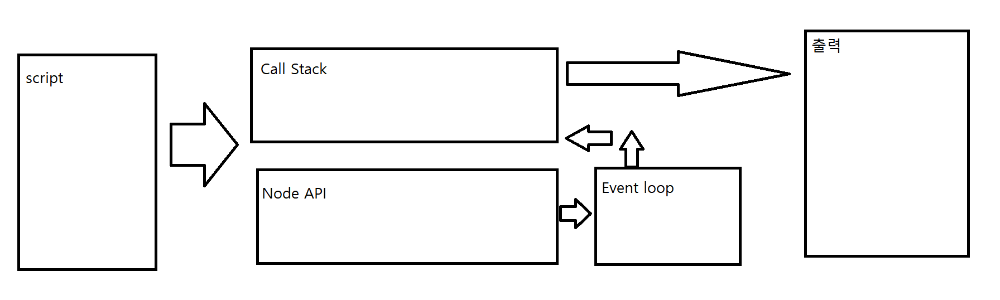

## 자바와 nodejs 의 차이

자바 : 멀티스레드 (여러개의 스레드를 두고 많은 서버로의 요청을 처리한다.)

nodejs : 싱글스레드 (비동기 이벤트 드리븐 방식)

*비동기 이벤트 드리븐 방식 : 비동기는 일단 미루고 간단한거부터 처리한다.

## nodeJS 이벤트 루프

1. js파일에서 Call Stack으로 들어옴
2. 오래걸리는(비동기적인) 코드는 NodeAPI로 보내
고, 다른 코드 먼저 처리
3.  Node API에서 순서대로 Event loop로 간다.
4. Call Stack이 비어있으면 Event loop에서 Call Stack으로 옮겨감

## 코드 예시

    console.log('1');
    setTimeout(()=>{console.log('2')}, 0);
    console.log('3');
    setTimeout(()=>{console.log('4')}, 1000);

위 코드의 결과는

1,3,2,4