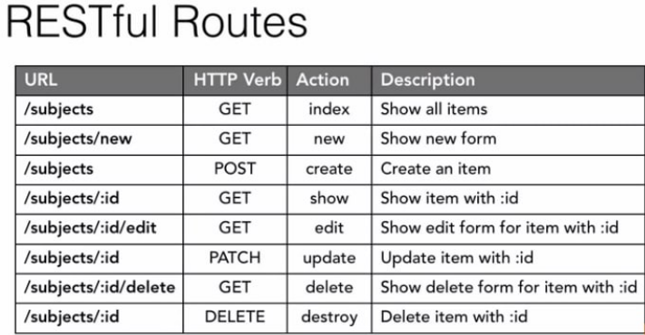

## RESTful Route란?

RESTful 규칙에 맞춰서 URL 을 디자인 하는 것

### 규칙

- GET : fetch와 같이 정보를 가져오는 것
- Post : 새로운 데이터를 생성
- Put : 데이터 수정
- Delete : 데이터 삭제

### 예시

id로 파라미터를 넘겨서 읽어서 페이지를 보여준다.

    function App() {
      return (
        <>
          <Routes>
            <Route path='/' element={<Home/>}></Route>
            <Route path='/about' element={<About/>}></Route>
            <Route path='/products' element={<Products/>}></Route>
            <Route path='/products/:id' element={<ProductsDetail/>}></Route>
          </Routes>
        </>
      );
    }

### RESTful Routes 사용 이유, 필요성

삭제하는 페이지, 생성,수정, 가져오기 페이지들이 있을 때 하나의 /products 로 규칙에 따라 사용할 수 있다. (/products 하나 만들었는데 4개나 사용할 수 있음 ㄷㄷ)