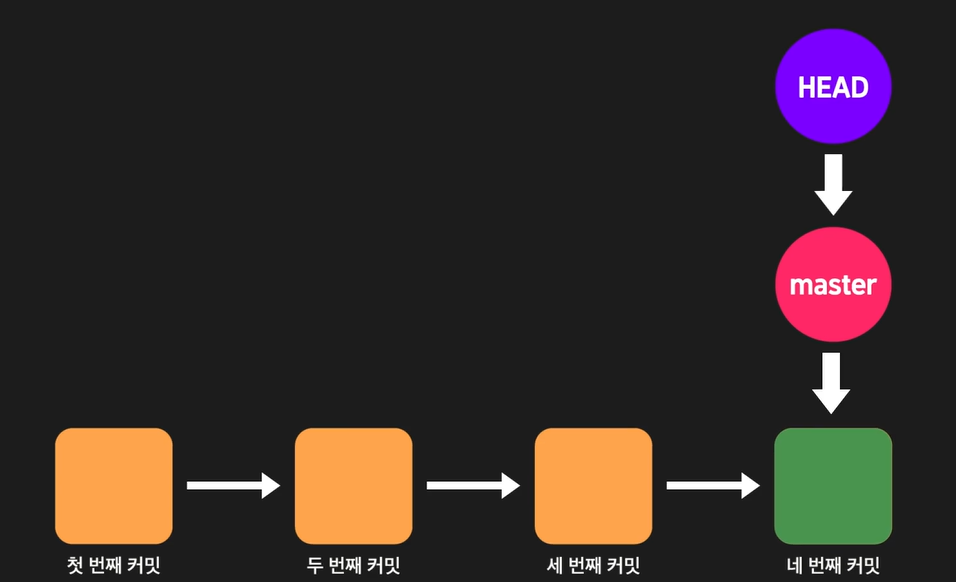
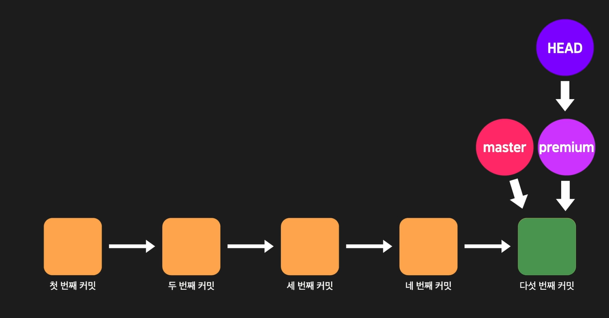
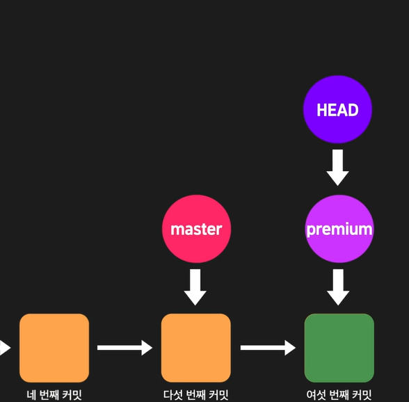
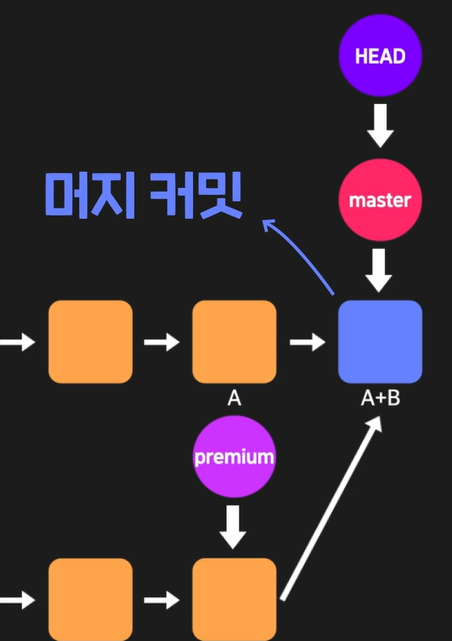

# HEAD 와 branch의 관계

HEAD는 결과적으로 commit을 가리킨다.

하지만 여기에 원리가 숨어져있다.

우리는 커밋할 때마다 master 브랜치는 커밋을 가리킴.

사실 HEAD는 commit을 가리키는 것이 아닌 브랜치를 가리키고, 해당 브랜치가 커밋을 가리키는 것이었다.

## 브랜치를 추가할 때

우리는 git checkout 을 통해서 브랜치를 이동하고 있었다.

이것이 HEAD가 가리키는 브랜치를 이동하는 개념이라고 보면 된다.

위와같이 브랜치가 바뀌었을 때 커밋을 추가하게 되면 아래와 같이 된다.

## merge

위와 같은 로직들로 봤을 때 merge를 한다는건 HEAD가 가리키던 커밋에 다른 브랜치가 가리키던 커밋을 합치는 것. 또 합쳐서 새로운 커밋을 만드는 작업이라고 볼 수 있다.

